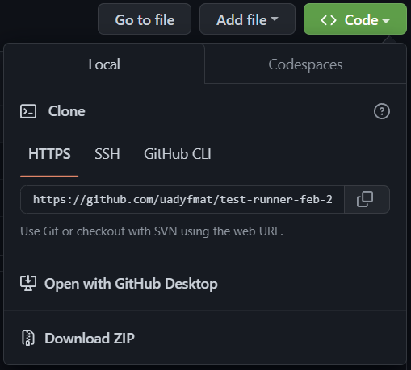
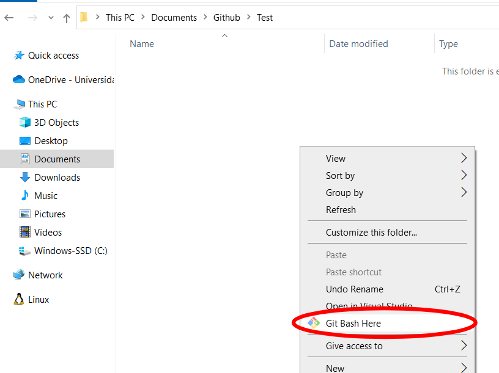
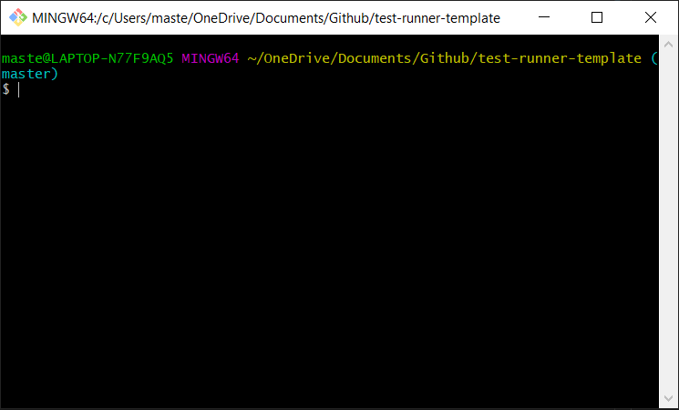
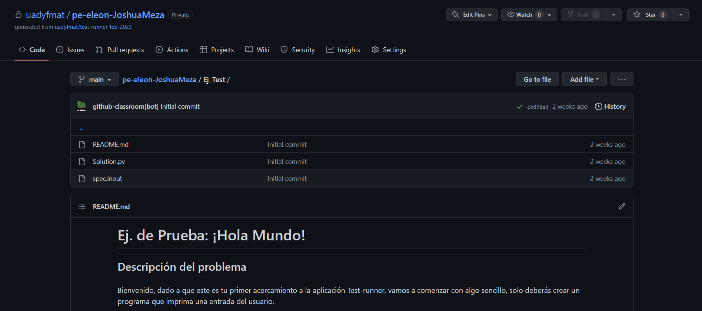
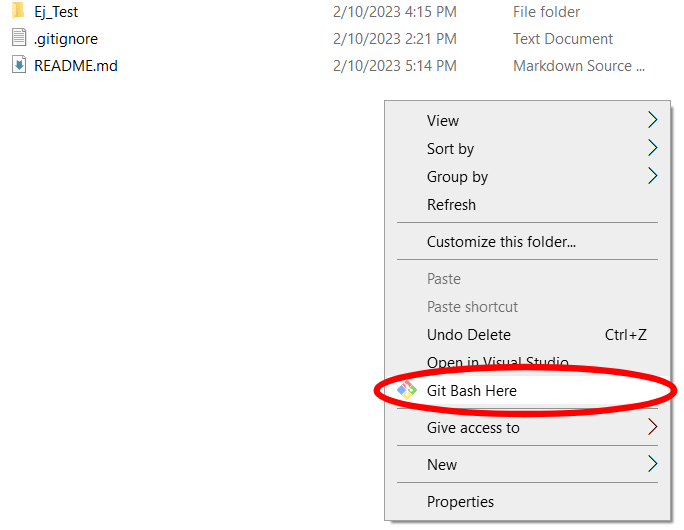
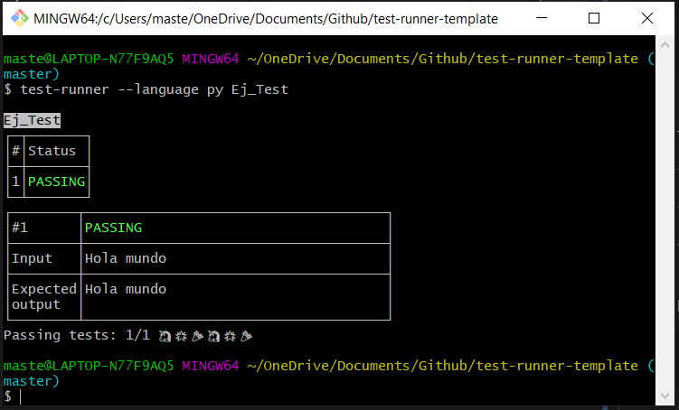

# Ejercicios de Programación Estructurada

## Contenidos

- [Introducción](#introducción)
- [Requerimientos](#requerimientos)
- [Validación de instalaciones](#validación-de-instalaciones)
- [Instalación de Test-runner](#instalación-de-test-runner)
- [Procedimiento de resolución de ejercicios](#procedimiento-de-resolución-de-ejercicios)
- [Documentación](#documentación)

## Introducción

Como parte de las actividades del Servicio Social 2023 para el proyecto "Sistema de Apoyo para el Aprendizaje de Programación para Estudiantes con Problemas de Rezago y Deserción", y en colaboración con los profesores M.I.T. Edwin Jesús León Bojorquez y Dr. Juan Pablo Ucán Pech, responsables de los cursos de Programación Estructurada 2023, se les presenta una serie de 11 ejercicios que deberán resolver y validar empleando la herramienta Test-runner.

Dicho esto, Test-runner es una aplicación de línea de comandos que es capaz de probar archivos de código contra casos de prueba de entrada y salida. Fue desarrollada por alumnos de la Facultad de Matemáticas y ha estado en constante evolución desde entonces.

Así, la meta de este ejercicio es obtener retroalimentación de los estudiantes respecto al estado actual del proyecto y, de esta manera, poder emprender acciones de mejora para adaptarlo a las necesidades actuales de los alumnos.

## Requerimientos

Para poder instalar el Test-runner necesitas:

- Git
- NodeJs v12+
- NPM

Para poder realizar y probar tus ejercicios requieres:

- Visual Studio Code
- C

## Validación de instalaciones

Antes de poder instalar Test-runner, valida que tengas **todas** las dependencias ejecutando los siguientes comandos en la `Command Prompt` (`cmd`):

```text
git --version
node --version
npm --version
gcc --version
```

Si te salió el número de la versión después de cada comando, estás listo. Ahora, si no te salió, puede que:

- No tengas instalado el software
- Tu computadora no es capaz de encontar dónde se instaló (en este caso, investiga como agregarlo a tus _variables del entorno_)
- Otra razón que desconocemos (tendrías que investigar que sucedió y como solucionarlo)

## Instalación de Test-runner

Ejecuta en la `Command Prompt` (`cmd`) el siguiente comando:

```text
npm i -g uadyfmat/test-runner
```

Para validar que se instaló correctamente, ejecuta el comando:

```text
test-runner --version
```

Si te devolvió un mensaje con la versión, está todo listo y funcional.

## Procedimiento de resolución de ejercicios

### Descarga del repositorio

Para tener de forma local el proyecto debes de realizar una serie de acciones, empezando por copiar la url del clonado del repositorio, misma que podrás encontrar en la ventana principal del repositorio.

<p align="center">
    
</p>

Luego, elige el directorio donde vas a querer que se descargue la carpeta que contiene el repositorio de GitHub. Una vez hecho esto, abre la terminal de `GitBash` (debió instalarse junto con Git) en la carpeta dando click derecho y posteriormente seleccionando la opción _Git Bash here_, tal y como se ilustra a continuación:

<p align="center">
    
</p>

Lo cual abrirá una terminal como la siguiente:

<p align="center">
    
</p>

Aquí es dónde deberás ejecutar el comando:

```text
git clone <url que copiaste>
```

Y listo, ya deberías tener el repositorio en tu computadora.

### Resolución de ejercicios

Primero, deberás seleccionar un lenguaje de programación que la aplicación sea capaz de evaluar, estos son:

- C
- C++
- Java
- Python

> Nota 1: **Deberás haber instalado previamente** en tu computadora todos aquellos lenguajes de programación que desees probar con Test-runner, porque si no, va a fallar.

> Nota 2: No olvides utilizar el lenguaje que haya especificado tu profesor.

Ahora, solo deberás abrir la carpeta del repositorio (la que se te creó en el paso anterior y que contiene todos los ejercicios) con el editor de Visual Studio Code.

De igual forma, cada carpeta contiene un archivo `README.md`, el cual describe el problema a resolver. Como recomendación, entrar desde tu repositorio de GitHub a la carpeta para que te muestre de forma amigable lo que tienes que hacer.

<p align="center">
    
</p>

Luego, para responder los problemas, solo deberás crear crear tu archivo dentro de la carpeta del ejercicio correspondiente, puedes tomar como referencia el _00-Ejemplo_ que ya está terminado.

> Nota 3: **No modifiques ni borres** las carpetas de ejercicios, así como los archivos `README.md` y `spec.inout`, ya que esto podría ocasionar problemas más adelante.

Además, es súmamente importante que tu archivo tenga por nombre `Solution`, o no podrá ser detectado. Por ejemplo, suponiendo que elegiste `C`, tu archivo deberá llamarse `Solution.c`.

Por último, **todas las salidas deben de ser idénticas** a las que especifica el problema, y cuando pidas la entrada del usuario no pongas textos adicionales porque te va a contar como salida. Por ejemplo:

_Escriba un programa que devuelva la palabra "Joven" si la persona ingresa una edad menor a 18 años, en caso contrario imprima "Adulto"._

|         | Correcto | Incorrecto            |
| :------ | :------- | :-------------------- |
| Entrada | `18`     | `Ingrese su edad: 18` |
| Salida  | `Adulto` | `Usted es: Adulto`    |

### Validación de resultados

Una vez hayas terminado tu ejercicio, para validar tu algoritmo primero deberás abrir una terminal (de tipo _bash_) en la carpeta raíz del repositorio.

> Nota 4: Opciones como `Command Prompt` (`cmd`) y `PowerShell` no van a funcionar, por lo que, podrás usar `Git Bash` en su lugar.

Ahora, la forma más sencilla de hacerlo es dar click derecho dentro de la carpeta que contiene todos los archivos del proyecto y seleccionar la opción de _Git Bash here_, como se muestra a continuación:

<p align="center">
    
</p>

Lo cual abrirá una terminal como la siguiente:

<p align="center">
    
</p>

Aquí es dónde deberás ejecutar el siguiente comando:

```text
test-runner --language <código de lenguaje> <carpeta del ejercicio>
```

| Lenguaje | Código |
| :------: | :----: |
|    C     |   c    |
|   C++    |  cpp   |
|   Java   |  java  |
|  Python  |   py   |

Por ejemplo, prueba con el siguiente comando que evaluará el ejercicio de ejemplo:

```text
test-runner --language c 00-Ejemplo
```

Deberías visualizar la siguiente salida:

<p align="center">
    
</p>

### Subir la tarea

> Nota 5: Es muy recomendable que hayas configurado tu git con anterioridad para tener tu [nombre de usuario](https://docs.github.com/en/get-started/getting-started-with-git/setting-your-username-in-git) y [correo electrónico](https://docs.github.com/en/account-and-profile/setting-up-and-managing-your-personal-account-on-github/managing-email-preferences/setting-your-commit-email-address) de GitHub correctos, ya que podrías presentar problemas más adelante.

Primero, abre la terminal de `GitBash` tal y como hiciste en el paso anterior. Una vez hecho esto, deberás ejecutar los siguientes comandos.

```text
git add .
git commit -m "<Descripción del commit>"
git push origin main
```

### Problemas al subir la tarea

En el caso de que hayas tenido problemas al subir tu tarea, hay algunas posibles causas:

- Intentaste subir cambios en una red abierta, como la red de la facultad, lo cual GitHub no permite.
- Te pide autenticarte. En este caso, ingresa en la caja de texto emergente tus credenciales de tu cuenta de GitHub.
- No estás en la rama correcta. La solución más sencilla a este problema consiste en ejecutar los comandos `git checkout -b main`, `git merge master` y `git push origin main` en la terminal de `GitBash`.

En el supuesto caso de presentar un problema que no esté listado en la sección anterior, favor de intentar investigar una solución o ponerse en contacto (vía Microsoft Teams) con el equipo responsable de la práctica.

## Documentación

Para más información, puede consultar la [documentación oficial](https://github.com/uadyfmat/test-runner) y la [documentación adicional](https://github.com/uadyfmat/test-runner-autoevaluacion-github), dónde esta última contiene apartados especialmente diseñados para:

- Alumnos
- Maestros
- Desarrolladores
- Preguntas Frecuentes

Por otra parte, se incluyen dos videos que pueden ser de utilidad:

- [Tutorial oficial de instalación y uso](https://youtu.be/YV7xHDyxMRs)
- [Sesión grupal del 13 de febrero de 2023](https://youtu.be/Nz9diF_w3Jk)
